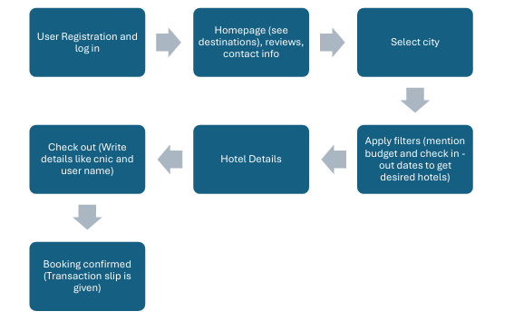

# Tour travel website

### Introduction 
The travel and tourism industry has evolved significantly in the modern era, with more people seeking seamless solutions to plan their trips and book accommodations online. Our Hotel Room Booking Website is designed to offer an efficient and user-friendly platform for travellers worldwide. This website aims to simplify the booking process by allowing users to browse various destinations, filter options based on their specific budget, and securely complete bookings. By focusing on intuitive navigation and customized filters, we aim to enhance the overall travel planning experience for users.

### Problem Statement: 
Travel planning, particularly finding accommodations, often presents several challenges. 
Travelers frequently encounter issues such as: 
- Overwhelming Choices: Many booking platforms list thousands of accommodations, 
making it difficult for users to find options that align with their preferences. 
- Inadequate Filtering Options: Limited filtering for location, and budget can make it 
hard for travelers to narrow down choices effectively. 

Addressing these issues is essential to creating a better experience for travelers, particularly 
those who want to streamline the booking process and feel confident in their choices. 

### Objectives: 
The primary goal of our website is to create a simplified and intuitive hotel booking platform. Our specific objectives are as follows: 
1. *User Registration and Login*: Implement a secure and easy-to-use system that 
allows users to create accounts and log in. 
2. *Visual Appeal and Navigation:* Design an engaging homepage that showcases 
popular travel destinations, allowing users to easily select a city of interest. 
3. *Accommodation Filtering Options:* Enable users to filter accommodations by budget, helping them find the best match quickly. 
4. *Detailed Hotel Information:* Provide comprehensive information on each hotel, including images, descriptions, amenities, and reviews, to aid informe decision making.
5. *Secure Checkout System:* Implement a secure and straightforward process to instil 
confidence in users when making reservations.
7. *Responsive Design:* Ensure that the website is accessible and visually appealing on 
various devices, including desktops, tablets, and smartphones.

### Implementation: 
The implementation of this project relies on a combination of front-end and back-end 
technologies, working in sync to deliver an efficient and secure user experience. Here’s an 
outline of the core processes and a flowchart illustrating the user journey. 

### Technologies Used: 
-  Frontend:
       HTML, CSS, and JavaScript for structure, styling, and interactivity.
   
-  Backend:
        PHP for handling server requests, managing user data, and processing bookings.
   
- Database:
   MySQL to store and manage user information, hotel details, and booking records.

### Flowchart

Data base design

